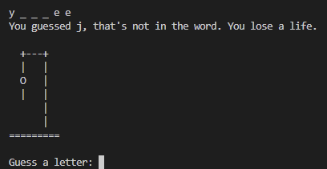

# Python-project-files
My project files using Python
## hangman
#### Purpose:  
Build the basic version of the hangman game
#### Output:

## Tic Tac Toe
#### Purpose:  
Build a basic version of the tic tac toe game.
